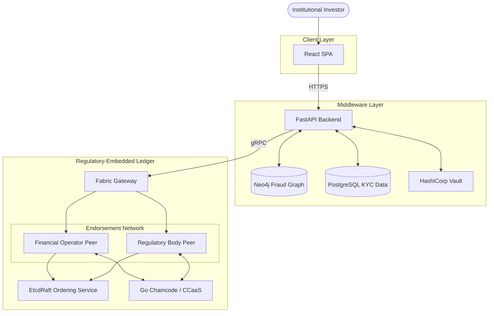
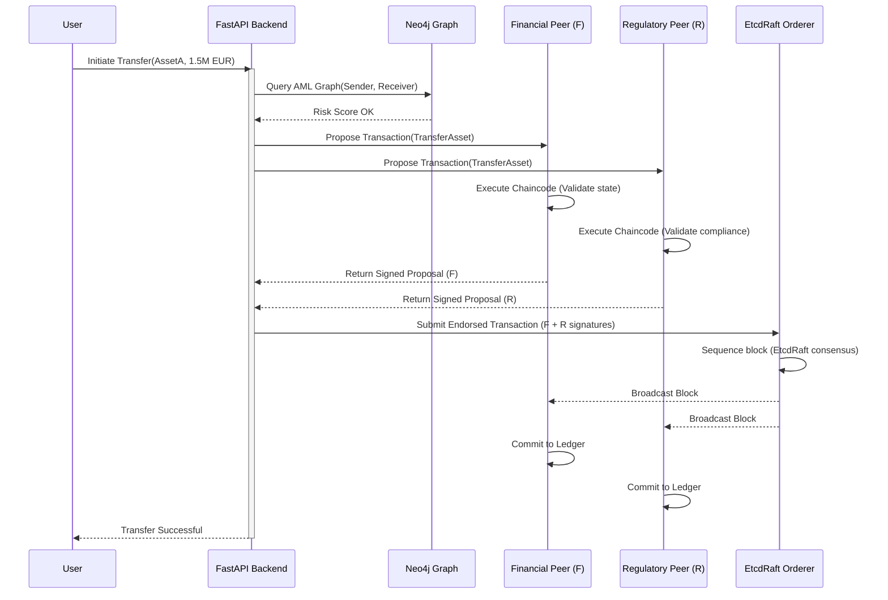

# Architecture & Flow Diagrams (Mermaid)

These diagrams visualize the Regulatory-Embedded Consensus (REC) architecture and execution flows.

## A. System Architecture Diagram

This diagram maps the high-level components from the user frontend down to the distributed ledger components.



---

## B. Transaction Flow Diagram

This flow shows the end-to-end journey of a transaction, highlighting the off-chain AML gatekeeping and the on-chain endorsement.



---

## C. REC Validation Flow

This diagram illustrates the internal logic of the Regulatory-Embedded Consensus Model, specifically how the endorsement policy $\mathbb{E}(\mathcal{T})$ is satisfied before committing.

```mermaid
flowchart TD
    Start([Transaction Proposal]) --> Split{Send to Endorsers}
    
    Split --> Bank[Financial Operator]
    Split --> Reg[Regulatory Body]
    
    subgraph Endorsement Policy: Sign(F) AND Sign(R)
        Bank -->|V_state| B_Valid{State Valid?}
        B_Valid -->|Yes| B_Sign[Sign Transaction]
        B_Valid -->|No| Reject1([Reject])
        
        Reg -->|V_comp| R_Valid{Compliant?}
        R_Valid -->|Yes| R_Sign[Sign Transaction]
        R_Valid -->|No| Reject2([Reject])
    end
    
    B_Sign --> Assemble
    R_Sign --> Assemble
    
    Assemble{Both Signatures Present?}
    Assemble -->|Yes| Orderer[Send to EtcdRaft Orderer]
    Assemble -->|No| Reject3([Transaction Fails])
    
    Orderer --> Commit([Commit to Immutable Ledger])
```
