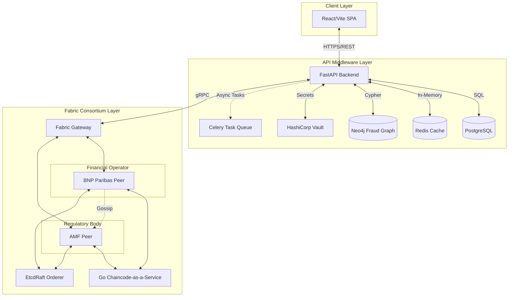

# System Architecture: Regulatory-Embedded RWA Tokenization

This document outlines the architectural components of the Institutional Real-World Asset (RWA) Tokenization platform. The system is designed with a **compliance-first** approach, ensuring that decentralized asset transfers adhere strictly to traditional financial regulations (e.g., KYC, AML, MiCA).

## High-Level Architecture Diagram

## Component Breakdown

### 1. The Distributed Ledger (Hyperledger Fabric)
The core immutable ledger is governed by a **Regulatory-Embedded Consensus**.
- **Consensus:** EtcdRaft orderer for Crash Fault Tolerance (CFT) and deterministic finality.
- **Peers:** Two primary endorsing peers: one for the financial operator (e.g., BNP Paribas) and one for the regulator (e.g., AMF).
- **Chaincode (CCaaS):** Written in Go, deployed as an external gRPC service. It executes functions like `TokenizeAsset`, `TransferAsset`, `FreezeAsset`, and `UnfreezeAsset`. It strictly validates ISINs, LEIs, ISO currencies, and triggers MiCA Article 68 alerts for transactions over 1,000,000 EUR.

### 2. High-Performance Middleware (FastAPI)
The Python-based middleware bridges client requests to the blockchain network and handles heavy off-chain computation.
- **Neo4j (Fraud Detection):** Used to map complex transaction graphs and entity relationships to detect money laundering rings prior to on-chain execution.
- **PostgreSQL:** Stores off-chain PII (Personally Identifiable Information) and KYC documents to ensure compliance with GDPR (which prohibits storing PII on immutable ledgers).
- **Redis:** Provides high-speed caching and rate limiting.
- **HashiCorp Vault:** Manages cryptographic secrets, API keys, and connection profiles securely.
- **Celery:** Orchestrates asynchronous background tasks (e.g., generating audit reports, syncing Fabric events).
- **Prometheus Metrics:** Exposes deep system metrics (`RWA_CHAINCODE_DURATION`, `RWA_COMPLIANCE_BLOCKS`, etc.) for observability.

### 3. Client Interface (React/Vite)
A modern Single Page Application (SPA) that provides a user-friendly dashboard for asset managers, abstracting away the complex cryptographic signing processes and exposing portfolio overviews and regulatory alerts.
